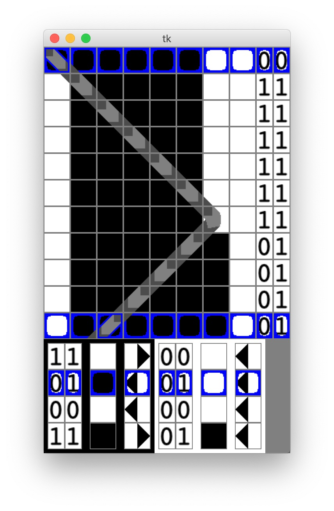

# Oak
Turing Machine Synthesis based on a SAT solver

**Status:** Usable work in progress. Capable of reasonably effective live Turing machine synthesis, but bug fixes and key features are still missing. Theory documents are a very rough draft and riddled with holes.

**Dependencies** that need to be installed manually are:

1. Python 3 (Tested on 3.8.2)

2. Tkinter and Tk

3. pillow (install with `$pip3 install pillow` or similar)

4. pycosat (install with `$pip3 install pycosat` or similar)

**Run** with `$cd Program`, and `$python3 main.py`, or execute main.py from IDLE