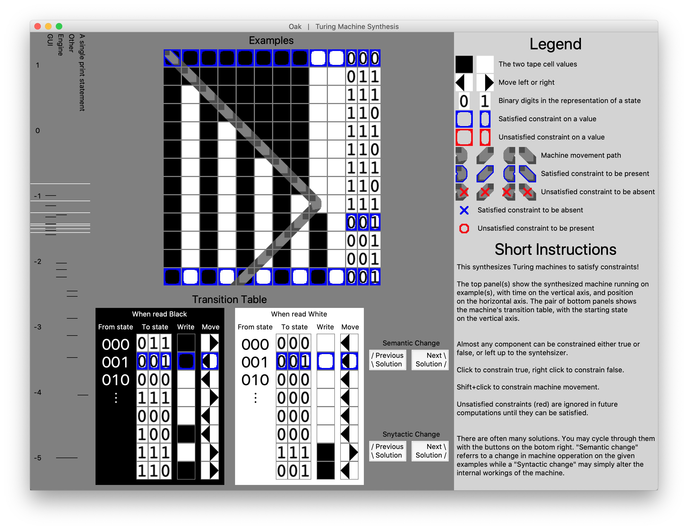

# Oak
# Turing

Turing Machine Synthesis based on a SAT solver

**Status:** Complete. Capable of live Turing machine synthesis. Note: this is a research tool, and a precursor to a more complete system which operates on a different language. The theory document is a very rough draft and riddled with holes, and the GUI does not support all features allowed for my the theory and supported by the engine. Notably missing are the ability to live and dynamically add or remove examples, adjust example sizes, and change the number of states.

**Setup:** 

1. `$pip install pillow` 
4. `$pip install pycosat`
3. `$cd Turing/Program`
4. `$python3 main.py`
